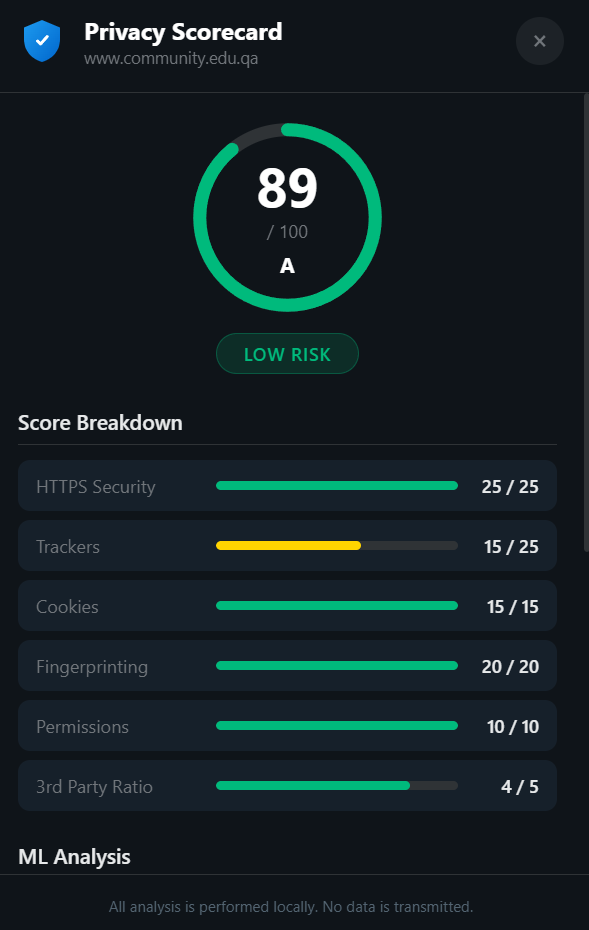

# 🔐 Privacy Scorecard Chrome Extension

A real-time web privacy analysis tool that evaluates:
- HTTPS security
- Cookies
- Third-party trackers
- Browser fingerprinting risks

## 🚀 Features
- Real-time privacy scoring
- Local data processing (no data collection)
- Rule-based + Machine Learning analysis

## 📥 How to Install
1. Download this repository
2. Open Google Chrome
3. Go to chrome://extensions/
4. Enable Developer Mode
5. Click "Load unpacked"
6. Select the project folder

## 📸 Extension Preview

## 📥 Installation Guide
[Download Installation Guide](installation_guide.pdf)

## 👩‍💻 Developed by the students of Community College Of Qatar 
Shaikha Jamal Almansouri, 
Sabha Mubarak Bujaloof, 
Alshaymaa Saleh Mathala 
